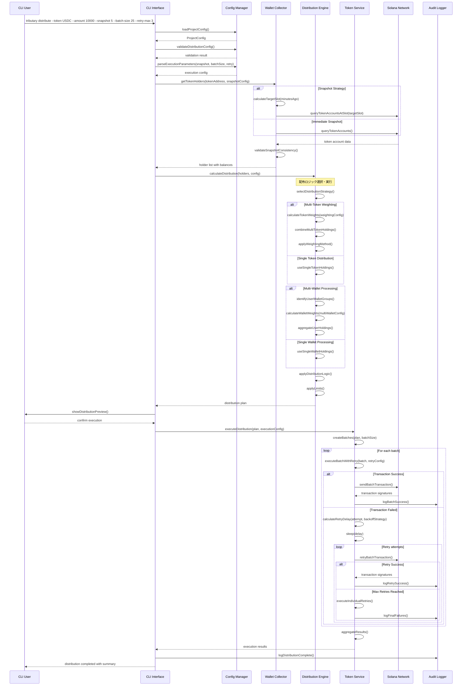
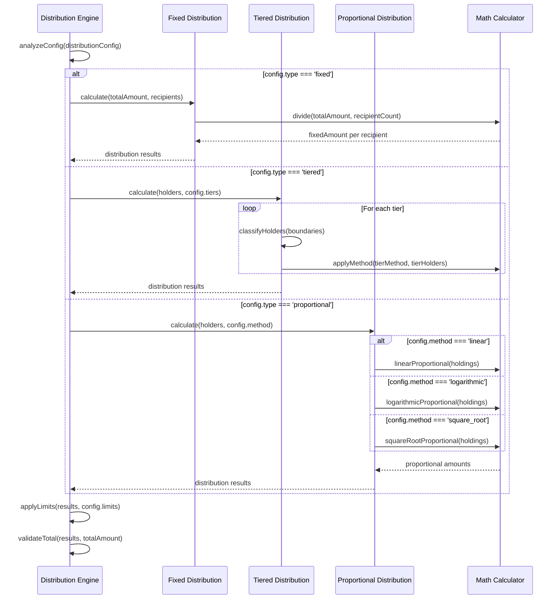
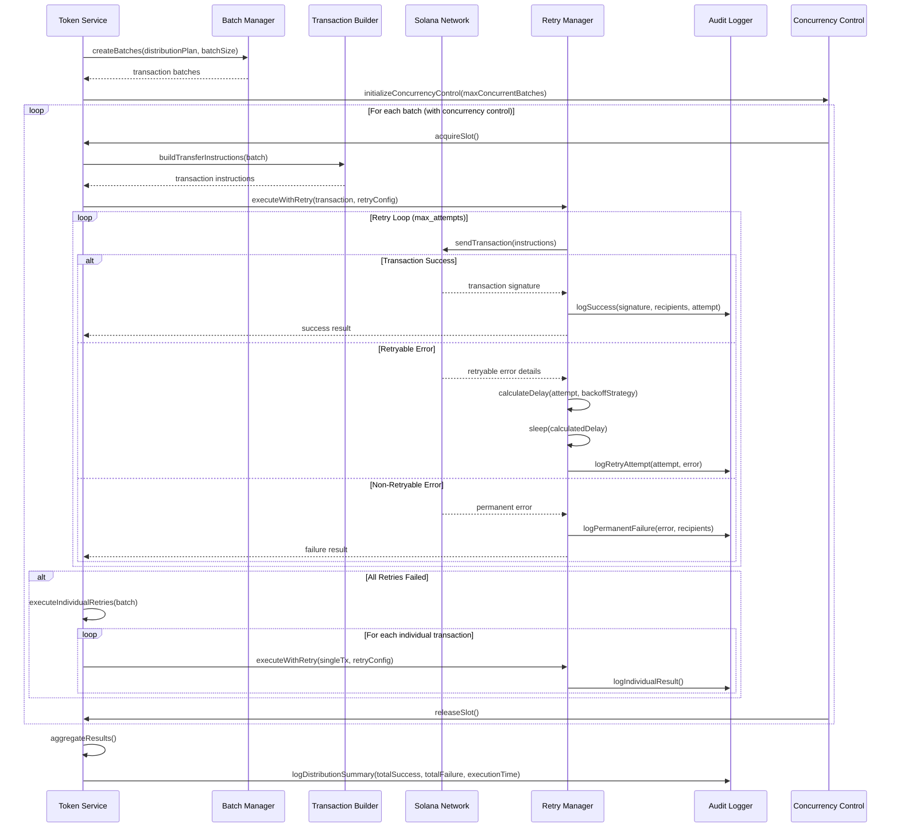
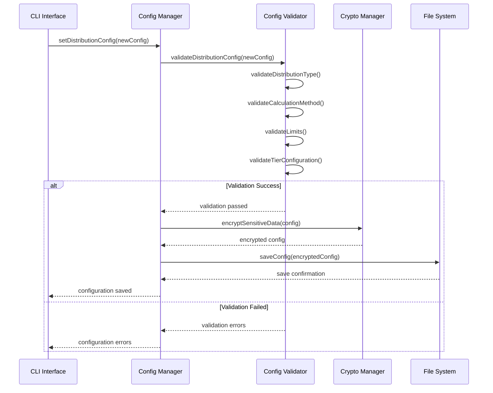
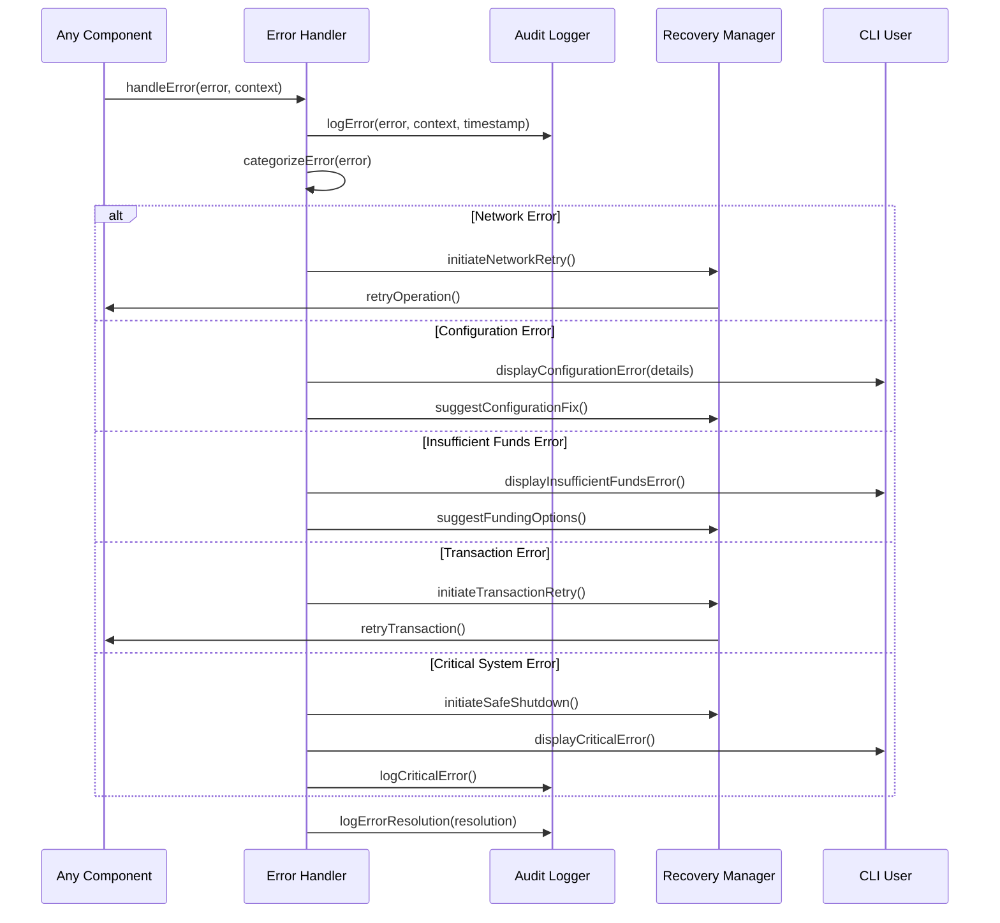
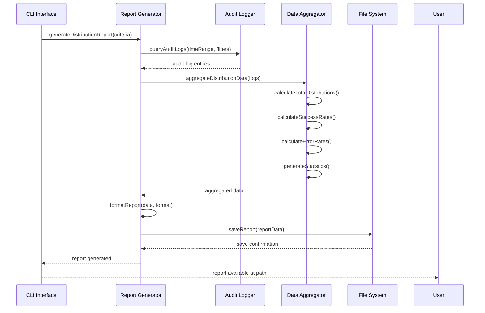

# 配布システム シーケンス図

## 1. 配布実行の全体フロー

```mermaid
sequenceDiagram
    participant User as CLI User
    participant CLI as CLI Interface
    participant ConfigMgr as Config Manager
    participant Collector as Wallet Collector
    participant DistEngine as Distribution Engine
    participant TokenSvc as Token Service
    participant Solana as Solana Network
    participant Logger as Audit Logger

    User->>CLI: tributary distribute --token USDC --amount 10000 --snapshot 5 --batch-size 25 --retry-max 3

    CLI->>ConfigMgr: loadProjectConfig()
    ConfigMgr-->>CLI: ProjectConfig

    CLI->>ConfigMgr: validateDistributionConfig()
    ConfigMgr-->>CLI: validation result

    CLI->>ConfigMgr: parseExecutionParameters(snapshot, batchSize, retry)
    ConfigMgr-->>CLI: execution config

    CLI->>Collector: getTokenHolders(tokenAddress, snapshotConfig)

    alt Snapshot Strategy
        Collector->>Collector: calculateTargetSlot(minutesAgo)
        Collector->>Solana: queryTokenAccountsAtSlot(targetSlot)
    else Immediate Snapshot
        Collector->>Solana: queryTokenAccounts()
    end

    Solana-->>Collector: token account data
    Collector->>Collector: validateSnapshotConsistency()
    Collector-->>CLI: holder list with balances

    CLI->>DistEngine: calculateDistribution(holders, config)

    Note over DistEngine: 配布ロジック選択・実行
    DistEngine->>DistEngine: selectDistributionStrategy()

    alt Multi-Token Weighting
        DistEngine->>DistEngine: calculateTokenWeights(weightingConfig)
        DistEngine->>DistEngine: combineMultiTokenHoldings()
        DistEngine->>DistEngine: applyWeightingMethod()
    else Single Token Distribution
        DistEngine->>DistEngine: useSingleTokenHoldings()
    end

    alt Multi-Wallet Processing
        DistEngine->>DistEngine: identifyUserWalletGroups()
        DistEngine->>DistEngine: calculateWalletWeights(multiWalletConfig)
        DistEngine->>DistEngine: aggregateUserHoldings()
    else Single Wallet Processing
        DistEngine->>DistEngine: useSingleWalletHoldings()
    end

    DistEngine->>DistEngine: applyDistributionLogic()
    DistEngine->>DistEngine: applyLimits()

    DistEngine-->>CLI: distribution plan

    CLI->>User: showDistributionPreview()
    User-->>CLI: confirm execution

    CLI->>TokenSvc: executeDistribution(plan, executionConfig)

    TokenSvc->>TokenSvc: createBatches(plan, batchSize)

    loop For each batch
        TokenSvc->>TokenSvc: executeBatchWithRetry(batch, retryConfig)

        alt Transaction Success
            TokenSvc->>Solana: sendBatchTransaction()
            Solana-->>TokenSvc: transaction signatures
            TokenSvc->>Logger: logBatchSuccess()

        else Transaction Failed
            TokenSvc->>TokenSvc: calculateRetryDelay(attempt, backoffStrategy)
            TokenSvc->>TokenSvc: sleep(delay)

            loop Retry attempts
                TokenSvc->>Solana: retryBatchTransaction()
                alt Retry Success
                    Solana-->>TokenSvc: transaction signatures
                    TokenSvc->>Logger: logRetrySuccess()
                else Max Retries Reached
                    TokenSvc->>TokenSvc: executeIndividualRetries()
                    TokenSvc->>Logger: logFinalFailures()
                end
            end
        end
    end

    TokenSvc->>TokenSvc: aggregateResults()
    TokenSvc-->>CLI: execution results
    CLI->>Logger: logDistributionComplete()
    CLI-->>User: distribution completed with summary
```

## 2. 配布ロジック選択の詳細フロー

```mermaid
sequenceDiagram
    participant DistEngine as Distribution Engine
    participant FixedDist as Fixed Distribution
    participant TieredDist as Tiered Distribution
    participant PropDist as Proportional Distribution
    participant Calculator as Math Calculator

    DistEngine->>DistEngine: analyzeConfig(distributionConfig)

    alt config.type === 'fixed'
        DistEngine->>FixedDist: calculate(totalAmount, recipients)
        FixedDist->>Calculator: divide(totalAmount, recipientCount)
        Calculator-->>FixedDist: fixedAmount per recipient
        FixedDist-->>DistEngine: distribution results

    else config.type === 'tiered'
        DistEngine->>TieredDist: calculate(holders, config.tiers)

        loop For each tier
            TieredDist->>TieredDist: classifyHolders(boundaries)
            TieredDist->>Calculator: applyMethod(tierMethod, tierHolders)
        end

        TieredDist-->>DistEngine: distribution results

    else config.type === 'proportional'
        DistEngine->>PropDist: calculate(holders, config.method)

        alt config.method === 'linear'
            PropDist->>Calculator: linearProportional(holdings)
        else config.method === 'logarithmic'
            PropDist->>Calculator: logarithmicProportional(holdings)
        else config.method === 'square_root'
            PropDist->>Calculator: squareRootProportional(holdings)
        end

        Calculator-->>PropDist: proportional amounts
        PropDist-->>DistEngine: distribution results
    end

    DistEngine->>DistEngine: applyLimits(results, config.limits)
    DistEngine->>DistEngine: validateTotal(results, totalAmount)
```

## 3. トランザクション実行の詳細フロー

```mermaid
sequenceDiagram
    participant TokenSvc as Token Service
    participant BatchMgr as Batch Manager
    participant TxBuilder as Transaction Builder
    participant Solana as Solana Network
    participant RetryMgr as Retry Manager
    participant Logger as Audit Logger
    participant Semaphore as Concurrency Control

    TokenSvc->>BatchMgr: createBatches(distributionPlan, batchSize)
    BatchMgr-->>TokenSvc: transaction batches

    TokenSvc->>Semaphore: initializeConcurrencyControl(maxConcurrentBatches)

    loop For each batch (with concurrency control)
        Semaphore->>TokenSvc: acquireSlot()

        TokenSvc->>TxBuilder: buildTransferInstructions(batch)
        TxBuilder-->>TokenSvc: transaction instructions

        TokenSvc->>RetryMgr: executeWithRetry(transaction, retryConfig)

        loop Retry Loop (max_attempts)
            RetryMgr->>Solana: sendTransaction(instructions)

            alt Transaction Success
                Solana-->>RetryMgr: transaction signature
                RetryMgr->>Logger: logSuccess(signature, recipients, attempt)
                RetryMgr-->>TokenSvc: success result

            else Retryable Error
                Solana-->>RetryMgr: retryable error details
                RetryMgr->>RetryMgr: calculateDelay(attempt, backoffStrategy)
                RetryMgr->>RetryMgr: sleep(calculatedDelay)
                RetryMgr->>Logger: logRetryAttempt(attempt, error)

            else Non-Retryable Error
                Solana-->>RetryMgr: permanent error
                RetryMgr->>Logger: logPermanentFailure(error, recipients)
                RetryMgr-->>TokenSvc: failure result
            end
        end

        alt All Retries Failed
            TokenSvc->>TokenSvc: executeIndividualRetries(batch)

            loop For each individual transaction
                TokenSvc->>RetryMgr: executeWithRetry(singleTx, retryConfig)
                RetryMgr->>Logger: logIndividualResult()
            end
        end

        Semaphore->>TokenSvc: releaseSlot()
    end

    TokenSvc->>TokenSvc: aggregateResults()
    TokenSvc->>Logger: logDistributionSummary(totalSuccess, totalFailure, executionTime)
```

## 4. 設定管理とバリデーションフロー

```mermaid
sequenceDiagram
    participant CLI as CLI Interface
    participant ConfigMgr as Config Manager
    participant Validator as Config Validator
    participant CryptoMgr as Crypto Manager
    participant FileSystem as File System

    CLI->>ConfigMgr: setDistributionConfig(newConfig)

    ConfigMgr->>Validator: validateDistributionConfig(newConfig)

    Validator->>Validator: validateDistributionType()
    Validator->>Validator: validateCalculationMethod()
    Validator->>Validator: validateLimits()
    Validator->>Validator: validateTierConfiguration()

    alt Validation Success
        Validator-->>ConfigMgr: validation passed

        ConfigMgr->>CryptoMgr: encryptSensitiveData(config)
        CryptoMgr-->>ConfigMgr: encrypted config

        ConfigMgr->>FileSystem: saveConfig(encryptedConfig)
        FileSystem-->>ConfigMgr: save confirmation

        ConfigMgr-->>CLI: configuration saved

    else Validation Failed
        Validator-->>ConfigMgr: validation errors
        ConfigMgr-->>CLI: configuration errors
    end
```

## 5. エラーハンドリングとリカバリフロー

```mermaid
sequenceDiagram
    participant Component as Any Component
    participant ErrorHandler as Error Handler
    participant Logger as Audit Logger
    participant Recovery as Recovery Manager
    participant User as CLI User

    Component->>ErrorHandler: handleError(error, context)

    ErrorHandler->>Logger: logError(error, context, timestamp)

    ErrorHandler->>ErrorHandler: categorizeError(error)

    alt Network Error
        ErrorHandler->>Recovery: initiateNetworkRetry()
        Recovery->>Component: retryOperation()

    else Configuration Error
        ErrorHandler->>User: displayConfigurationError(details)
        ErrorHandler->>Recovery: suggestConfigurationFix()

    else Insufficient Funds Error
        ErrorHandler->>User: displayInsufficientFundsError()
        ErrorHandler->>Recovery: suggestFundingOptions()

    else Transaction Error
        ErrorHandler->>Recovery: initiateTransactionRetry()
        Recovery->>Component: retryTransaction()

    else Critical System Error
        ErrorHandler->>Recovery: initiateSafeShutdown()
        ErrorHandler->>User: displayCriticalError()
        ErrorHandler->>Logger: logCriticalError()
    end

    ErrorHandler->>Logger: logErrorResolution(resolution)
```

## 6. 監査とレポート生成フロー

```mermaid
sequenceDiagram
    participant CLI as CLI Interface
    participant ReportGen as Report Generator
    participant Logger as Audit Logger
    participant DataAggregator as Data Aggregator
    participant FileSystem as File System

    CLI->>ReportGen: generateDistributionReport(criteria)

    ReportGen->>Logger: queryAuditLogs(timeRange, filters)
    Logger-->>ReportGen: audit log entries

    ReportGen->>DataAggregator: aggregateDistributionData(logs)

    DataAggregator->>DataAggregator: calculateTotalDistributions()
    DataAggregator->>DataAggregator: calculateSuccessRates()
    DataAggregator->>DataAggregator: calculateErrorRates()
    DataAggregator->>DataAggregator: generateStatistics()

    DataAggregator-->>ReportGen: aggregated data

    ReportGen->>ReportGen: formatReport(data, format)

    ReportGen->>FileSystem: saveReport(reportData)
    FileSystem-->>ReportGen: save confirmation

    ReportGen-->>CLI: report generated
    CLI-->>User: report available at path
```