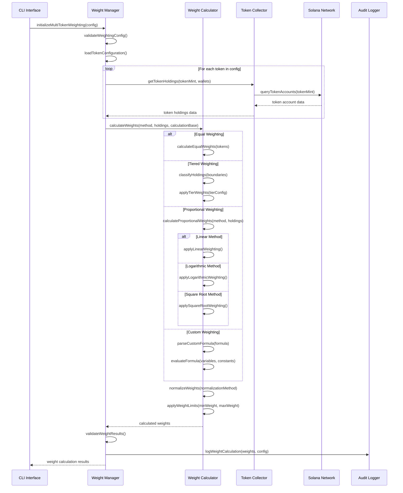
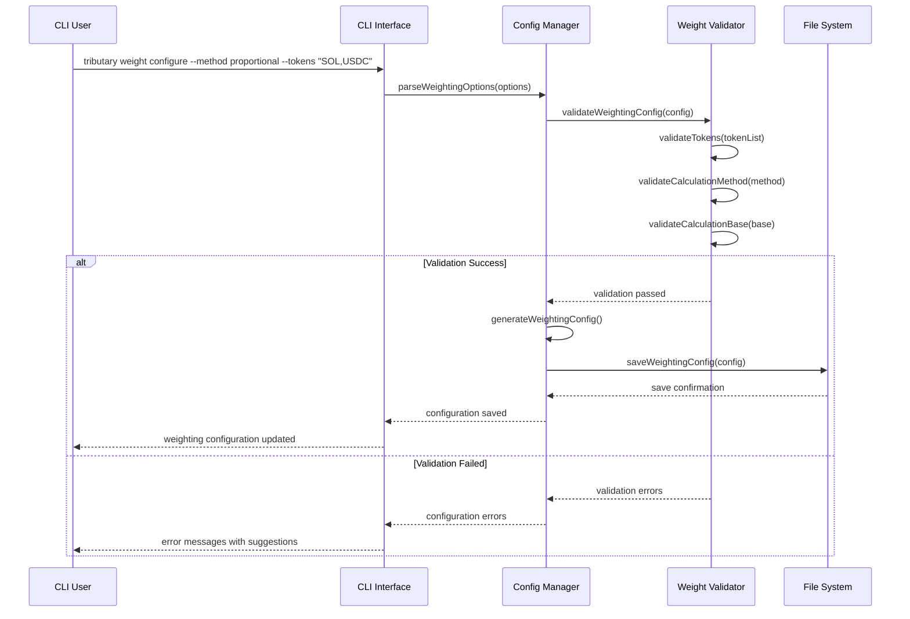
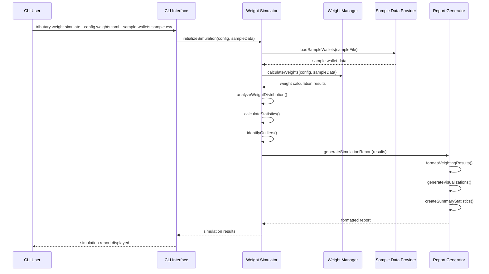
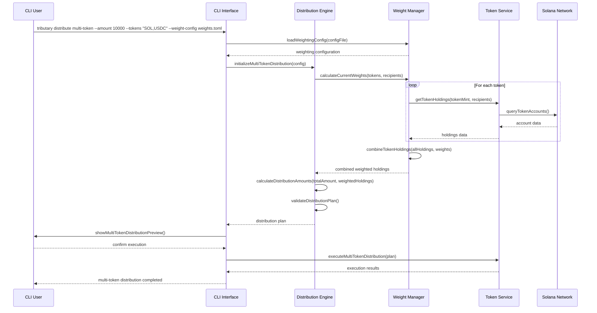

# マルチトークン重み付けシーケンス図

## マルチトークン重み付け処理の詳細フロー

```mermaid
sequenceDiagram
    participant CLI as CLI Interface
    participant WeightMgr as Weight Manager
    participant Calculator as Weight Calculator
    participant Collector as Token Collector
    participant Solana as Solana Network
    participant Logger as Audit Logger

    CLI->>WeightMgr: initializeMultiTokenWeighting(config)

    WeightMgr->>WeightMgr: validateWeightingConfig()
    WeightMgr->>WeightMgr: loadTokenConfiguration()

    loop For each token in config
        WeightMgr->>Collector: getTokenHoldings(tokenMint, wallets)
        Collector->>Solana: queryTokenAccounts(tokenMint)
        Solana-->>Collector: token account data
        Collector-->>WeightMgr: token holdings data
    end

    WeightMgr->>Calculator: calculateWeights(method, holdings, calculationBase)

    alt Equal Weighting
        Calculator->>Calculator: calculateEqualWeights(tokens)

    else Tiered Weighting
        Calculator->>Calculator: classifyHoldings(boundaries)
        Calculator->>Calculator: applyTierWeights(tierConfig)

    else Proportional Weighting
        Calculator->>Calculator: calculateProportionalWeights(method, holdings)

        alt Linear Method
            Calculator->>Calculator: applyLinearWeighting()
        else Logarithmic Method
            Calculator->>Calculator: applyLogarithmicWeighting()
        else Square Root Method
            Calculator->>Calculator: applySquareRootWeighting()
        end

    else Custom Weighting
        Calculator->>Calculator: parseCustomFormula(formula)
        Calculator->>Calculator: evaluateFormula(variables, constants)
    end

    Calculator->>Calculator: normalizeWeights(normalizationMethod)
    Calculator->>Calculator: applyWeightLimits(minWeight, maxWeight)

    Calculator-->>WeightMgr: calculated weights

    WeightMgr->>WeightMgr: validateWeightResults()
    WeightMgr->>Logger: logWeightCalculation(weights, config)

    WeightMgr-->>CLI: weight calculation results
```

## 重み付け設定フロー

```mermaid
sequenceDiagram
    participant User as CLI User
    participant CLI as CLI Interface
    participant ConfigMgr as Config Manager
    participant Validator as Weight Validator
    participant FileSystem as File System

    User->>CLI: tributary weight configure --method proportional --tokens "SOL,USDC"

    CLI->>ConfigMgr: parseWeightingOptions(options)
    ConfigMgr->>Validator: validateWeightingConfig(config)

    Validator->>Validator: validateTokens(tokenList)
    Validator->>Validator: validateCalculationMethod(method)
    Validator->>Validator: validateCalculationBase(base)

    alt Validation Success
        Validator-->>ConfigMgr: validation passed

        ConfigMgr->>ConfigMgr: generateWeightingConfig()
        ConfigMgr->>FileSystem: saveWeightingConfig(config)
        FileSystem-->>ConfigMgr: save confirmation

        ConfigMgr-->>CLI: configuration saved
        CLI-->>User: weighting configuration updated

    else Validation Failed
        Validator-->>ConfigMgr: validation errors
        ConfigMgr-->>CLI: configuration errors
        CLI-->>User: error messages with suggestions
    end
```

## 重み付けシミュレーションフロー

```mermaid
sequenceDiagram
    participant User as CLI User
    participant CLI as CLI Interface
    participant Simulator as Weight Simulator
    participant WeightMgr as Weight Manager
    participant DataProvider as Sample Data Provider
    participant Reporter as Report Generator

    User->>CLI: tributary weight simulate --config weights.toml --sample-wallets sample.csv

    CLI->>Simulator: initializeSimulation(config, sampleData)

    Simulator->>DataProvider: loadSampleWallets(sampleFile)
    DataProvider-->>Simulator: sample wallet data

    Simulator->>WeightMgr: calculateWeights(config, sampleData)
    WeightMgr-->>Simulator: weight calculation results

    Simulator->>Simulator: analyzeWeightDistribution()
    Simulator->>Simulator: calculateStatistics()
    Simulator->>Simulator: identifyOutliers()

    Simulator->>Reporter: generateSimulationReport(results)

    Reporter->>Reporter: formatWeightingResults()
    Reporter->>Reporter: generateVisualizations()
    Reporter->>Reporter: createSummaryStatistics()

    Reporter-->>Simulator: formatted report

    Simulator-->>CLI: simulation results
    CLI-->>User: simulation report displayed
```

## マルチトークン配布実行フロー

```mermaid
sequenceDiagram
    participant User as CLI User
    participant CLI as CLI Interface
    participant DistEngine as Distribution Engine
    participant WeightMgr as Weight Manager
    participant TokenSvc as Token Service
    participant Solana as Solana Network

    User->>CLI: tributary distribute multi-token --amount 10000 --tokens "SOL,USDC" --weight-config weights.toml

    CLI->>WeightMgr: loadWeightingConfig(configFile)
    WeightMgr-->>CLI: weighting configuration

    CLI->>DistEngine: initializeMultiTokenDistribution(config)

    DistEngine->>WeightMgr: calculateCurrentWeights(tokens, recipients)

    loop For each token
        WeightMgr->>TokenSvc: getTokenHoldings(tokenMint, recipients)
        TokenSvc->>Solana: queryTokenAccounts()
        Solana-->>TokenSvc: account data
        TokenSvc-->>WeightMgr: holdings data
    end

    WeightMgr->>WeightMgr: combineTokenHoldings(allHoldings, weights)
    WeightMgr-->>DistEngine: combined weighted holdings

    DistEngine->>DistEngine: calculateDistributionAmounts(totalAmount, weightedHoldings)
    DistEngine->>DistEngine: validateDistributionPlan()

    DistEngine-->>CLI: distribution plan

    CLI->>User: showMultiTokenDistributionPreview()
    User-->>CLI: confirm execution

    CLI->>TokenSvc: executeMultiTokenDistribution(plan)
    TokenSvc-->>CLI: execution results

    CLI-->>User: multi-token distribution completed
```