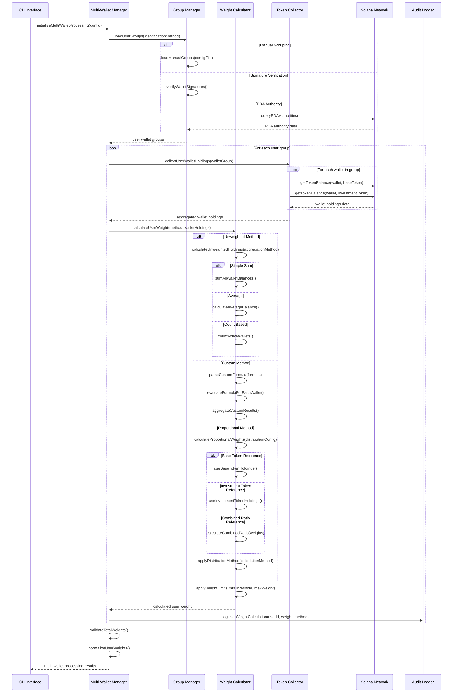
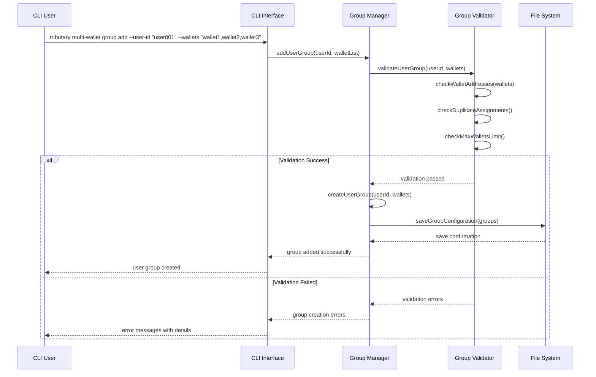
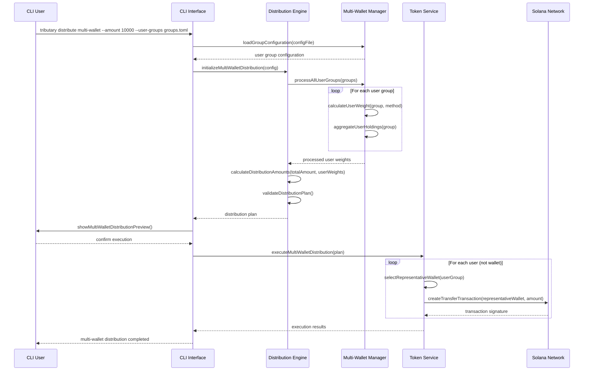
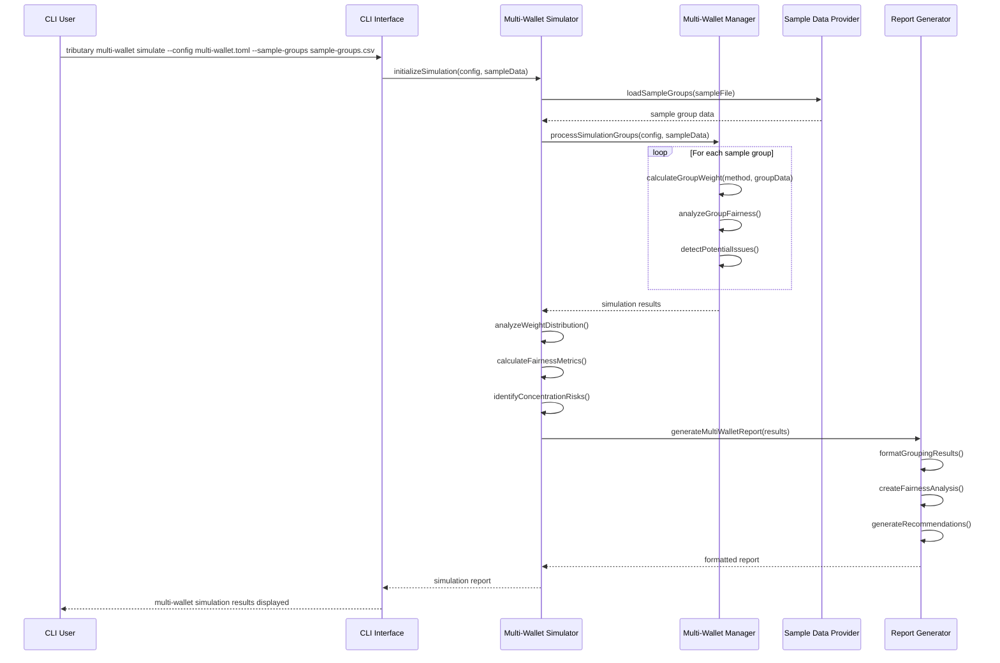

# マルチウォレットシーケンス図

## マルチウォレット重み付け処理の詳細フロー

```mermaid
sequenceDiagram
    participant CLI as CLI Interface
    participant MultiWallet as Multi-Wallet Manager
    participant GroupMgr as Group Manager
    participant WeightCalc as Weight Calculator
    participant Collector as Token Collector
    participant Solana as Solana Network
    participant Logger as Audit Logger

    CLI->>MultiWallet: initializeMultiWalletProcessing(config)

    MultiWallet->>GroupMgr: loadUserGroups(identificationMethod)

    alt Manual Grouping
        GroupMgr->>GroupMgr: loadManualGroups(configFile)
    else Signature Verification
        GroupMgr->>GroupMgr: verifyWalletSignatures()
    else PDA Authority
        GroupMgr->>Solana: queryPDAAuthorities()
        Solana-->>GroupMgr: PDA authority data
    end

    GroupMgr-->>MultiWallet: user wallet groups

    loop For each user group
        MultiWallet->>Collector: collectUserWalletHoldings(walletGroup)

        loop For each wallet in group
            Collector->>Solana: getTokenBalance(wallet, baseToken)
            Collector->>Solana: getTokenBalance(wallet, investmentToken)
            Solana-->>Collector: wallet holdings data
        end

        Collector-->>MultiWallet: aggregated wallet holdings

        MultiWallet->>WeightCalc: calculateUserWeight(method, walletHoldings)

        alt Unweighted Method
            WeightCalc->>WeightCalc: calculateUnweightedHoldings(aggregationMethod)

            alt Simple Sum
                WeightCalc->>WeightCalc: sumAllWalletBalances()
            else Average
                WeightCalc->>WeightCalc: calculateAverageBalance()
            else Count Based
                WeightCalc->>WeightCalc: countActiveWallets()
            end

        else Custom Method
            WeightCalc->>WeightCalc: parseCustomFormula(formula)
            WeightCalc->>WeightCalc: evaluateFormulaForEachWallet()
            WeightCalc->>WeightCalc: aggregateCustomResults()

        else Proportional Method
            WeightCalc->>WeightCalc: calculateProportionalWeights(distributionConfig)

            alt Base Token Reference
                WeightCalc->>WeightCalc: useBaseTokenHoldings()
            else Investment Token Reference
                WeightCalc->>WeightCalc: useInvestmentTokenHoldings()
            else Combined Ratio Reference
                WeightCalc->>WeightCalc: calculateCombinedRatio(weights)
            end

            WeightCalc->>WeightCalc: applyDistributionMethod(calculationMethod)
        end

        WeightCalc->>WeightCalc: applyWeightLimits(minThreshold, maxWeight)
        WeightCalc-->>MultiWallet: calculated user weight

        MultiWallet->>Logger: logUserWeightCalculation(userId, weight, method)
    end

    MultiWallet->>MultiWallet: validateTotalWeights()
    MultiWallet->>MultiWallet: normalizeUserWeights()

    MultiWallet-->>CLI: multi-wallet processing results
```

## ウォレットグループ管理フロー

```mermaid
sequenceDiagram
    participant User as CLI User
    participant CLI as CLI Interface
    participant GroupMgr as Group Manager
    participant Validator as Group Validator
    participant FileSystem as File System

    User->>CLI: tributary multi-wallet group add --user-id "user001" --wallets "wallet1,wallet2,wallet3"

    CLI->>GroupMgr: addUserGroup(userId, walletList)

    GroupMgr->>Validator: validateUserGroup(userId, wallets)

    Validator->>Validator: checkWalletAddresses(wallets)
    Validator->>Validator: checkDuplicateAssignments()
    Validator->>Validator: checkMaxWalletsLimit()

    alt Validation Success
        Validator-->>GroupMgr: validation passed

        GroupMgr->>GroupMgr: createUserGroup(userId, wallets)
        GroupMgr->>FileSystem: saveGroupConfiguration(groups)
        FileSystem-->>GroupMgr: save confirmation

        GroupMgr-->>CLI: group added successfully
        CLI-->>User: user group created

    else Validation Failed
        Validator-->>GroupMgr: validation errors
        GroupMgr-->>CLI: group creation errors
        CLI-->>User: error messages with details
    end
```

## マルチウォレット配布実行フロー

```mermaid
sequenceDiagram
    participant User as CLI User
    participant CLI as CLI Interface
    participant DistEngine as Distribution Engine
    participant MultiWallet as Multi-Wallet Manager
    participant TokenSvc as Token Service
    participant Solana as Solana Network

    User->>CLI: tributary distribute multi-wallet --amount 10000 --user-groups groups.toml

    CLI->>MultiWallet: loadGroupConfiguration(configFile)
    MultiWallet-->>CLI: user group configuration

    CLI->>DistEngine: initializeMultiWalletDistribution(config)

    DistEngine->>MultiWallet: processAllUserGroups(groups)

    loop For each user group
        MultiWallet->>MultiWallet: calculateUserWeight(group, method)
        MultiWallet->>MultiWallet: aggregateUserHoldings(group)
    end

    MultiWallet-->>DistEngine: processed user weights

    DistEngine->>DistEngine: calculateDistributionAmounts(totalAmount, userWeights)
    DistEngine->>DistEngine: validateDistributionPlan()

    DistEngine-->>CLI: distribution plan

    CLI->>User: showMultiWalletDistributionPreview()
    User-->>CLI: confirm execution

    CLI->>TokenSvc: executeMultiWalletDistribution(plan)

    loop For each user (not wallet)
        TokenSvc->>TokenSvc: selectRepresentativeWallet(userGroup)
        TokenSvc->>Solana: createTransferTransaction(representativeWallet, amount)
        Solana-->>TokenSvc: transaction signature
    end

    TokenSvc-->>CLI: execution results

    CLI-->>User: multi-wallet distribution completed
```

## ウォレットグループシミュレーションフロー

```mermaid
sequenceDiagram
    participant User as CLI User
    participant CLI as CLI Interface
    participant Simulator as Multi-Wallet Simulator
    participant MultiWallet as Multi-Wallet Manager
    participant DataProvider as Sample Data Provider
    participant Reporter as Report Generator

    User->>CLI: tributary multi-wallet simulate --config multi-wallet.toml --sample-groups sample-groups.csv

    CLI->>Simulator: initializeSimulation(config, sampleData)

    Simulator->>DataProvider: loadSampleGroups(sampleFile)
    DataProvider-->>Simulator: sample group data

    Simulator->>MultiWallet: processSimulationGroups(config, sampleData)

    loop For each sample group
        MultiWallet->>MultiWallet: calculateGroupWeight(method, groupData)
        MultiWallet->>MultiWallet: analyzeGroupFairness()
        MultiWallet->>MultiWallet: detectPotentialIssues()
    end

    MultiWallet-->>Simulator: simulation results

    Simulator->>Simulator: analyzeWeightDistribution()
    Simulator->>Simulator: calculateFairnessMetrics()
    Simulator->>Simulator: identifyConcentrationRisks()

    Simulator->>Reporter: generateMultiWalletReport(results)

    Reporter->>Reporter: formatGroupingResults()
    Reporter->>Reporter: createFairnessAnalysis()
    Reporter->>Reporter: generateRecommendations()

    Reporter-->>Simulator: formatted report

    Simulator-->>CLI: simulation report
    CLI-->>User: multi-wallet simulation results displayed
```